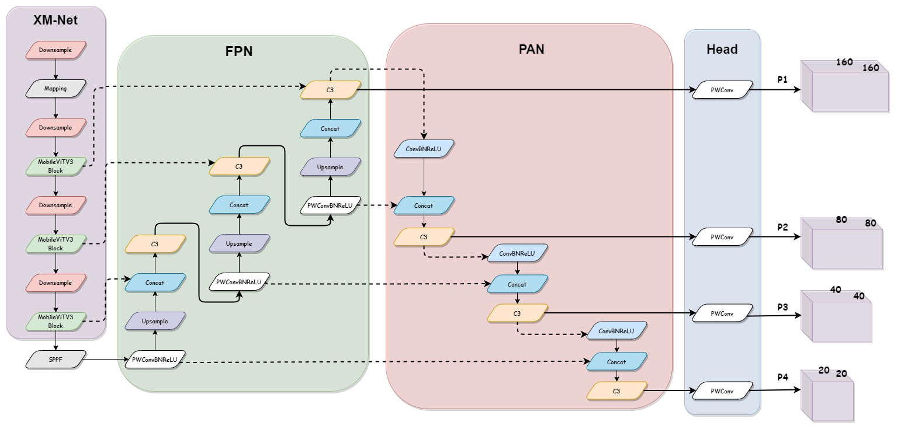
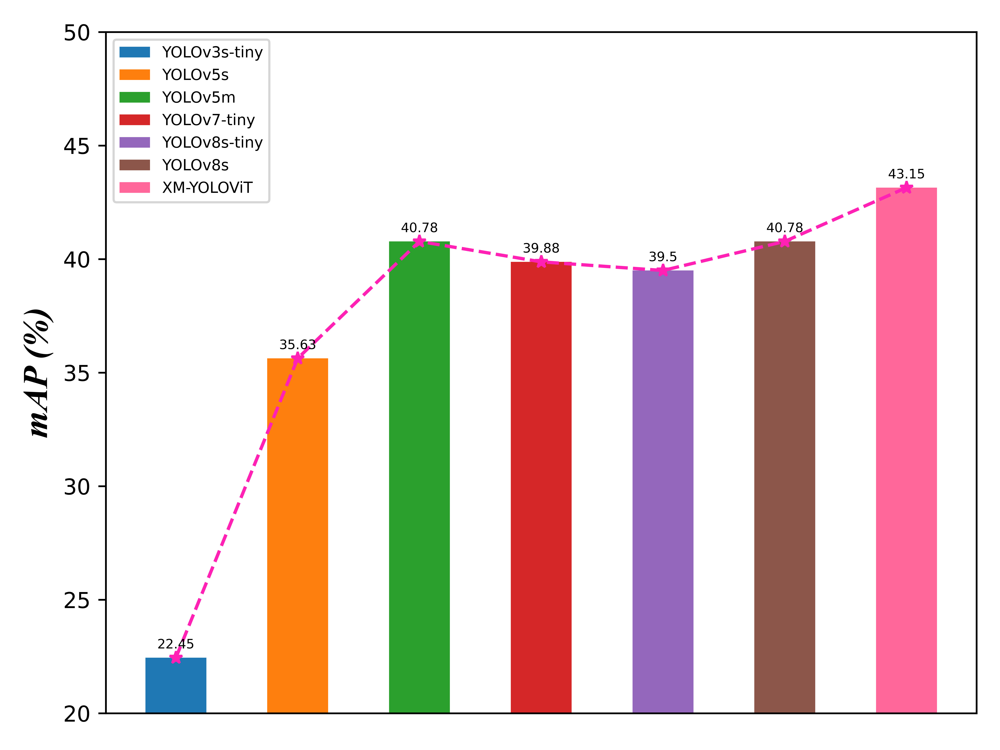
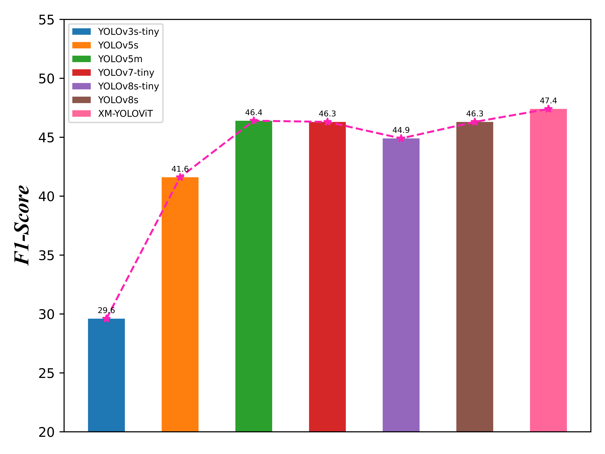

XM-YOLOViT
===
## Abstract: 
A novel XM-YOLOViT real-time detection algorithm for pedestrians and vehicles in foggy days based on YOLOV5 framework is proposed, which effectively solves the problems of dense target interference and obscuration by haze, and improves the detection effect in complex foggy environments.
## Papar Information
- Title:  `Research on real-time detection algorithm for
pedestrian and vehicle in foggy weather based
on lightweight XM-YOLOViT`
- DOI: [`10.1109/ACCESS.2023.3344666`](https://ieeexplore.ieee.org/abstract/document/10365179)



## Dataset Preparation
- Download

  | Dataset | Download |
  | ---     | ---   |
  | VisDrone-2019 | [download](https://github.com/VisDrone/VisDrone-Dataset) |
- Generating Foggy Day Image Data

  Sampling atmospheric light values and generating foggy sky images using generating.py
  ```
  cd datasets
  python generating.py
  ```
## Tested Platform
- Software
  ```
  OS: Pop!_OS 22.04 LTS
  Python: 3.9.17 (miniconda)
  PyTorch: 1.13.1
  ```
- Hardware
  ```
  CPU: 12th Gen Intel(R) Core(TM) i7-12700H
  GPU: NVIDIA RTX3050 Laptop (4GB)
  ```
## Test Results
  | mAP | F1-score |
  | ---     | ---   |
  || |
  
